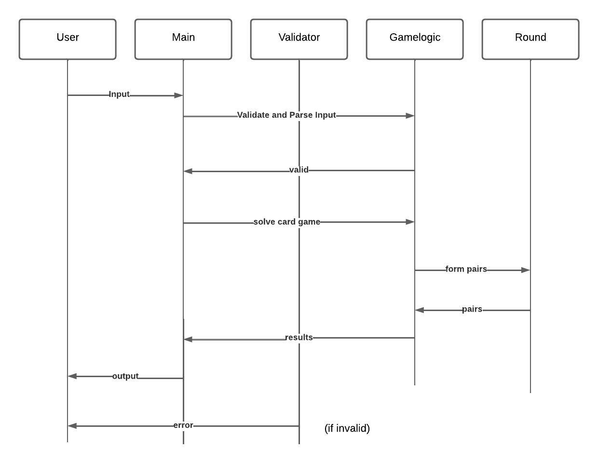

# Paradigm-CardGame

## Description
I chose to solve a problem involving a card game from codeforces (1400) 
The solution required must  reconstruct the sequence of rounds played in a card game based on a given set of rules. Each round involves two players playing a card, with the second player needing to beat the card played by the first.
I adapted my solution to this problem by adding the use of a CFG 
link: https://codeforces.com/problemset/problem/1932/D

I modelled my solution with a secuence diagram

## Model of the Solution

## Implementation
The solution is implemented in Python.

Recursive/Functional Paradigm

Input handling: The input is read from standard input (stdin) and parsed to extract the number of test cases, the number of rounds in each test case, the trump suit, and the descriptions of the cards.

Parsing and Validation: The input text is parsed and validated using a context-free grammar (CFG). The NLTK library is utilized for parsing the input text based on the defined grammar rules. The grammar ensures that the input follows the correct format and syntax required for the card game problem.

Card Comparison: The implementation defines rules for comparing cards to determine if one card can beat another. Cards are compared based on their ranks and suits, considering the trump suit if applicable.

Recursive Pair Formation: A recursive algorithm is used to form pairs of cards for each round of the game. Starting with all available cards, the algorithm recursively selects pairs of cards that meet the game rules until the required number of rounds is reached.

Result Generation: The implementation generates the output based on the formed pairs of cards. If a valid solution is found, the pairs of cards for each round are printed. Otherwise, "IMPOSSIBLE" is printed to indicate that no valid solution exists.

## Tests

The input test cases are shown in the code forces problem with its respective output. They are implemented in the end of the document and shown when running the code

The first line contains integer 𝑡 (1≤𝑡≤100) — the number of test cases. Then 𝑡 test cases follow.

The first line of a test case contains the integer number 𝑛 (1≤𝑛≤16).

The second line of a test case contains one character, the trump suit. It is one of "CDHS".

The third line of a test case contains the description of 2𝑛 cards. Each card is described by a two-character string, the first character is the rank of the card, which is one of "23456789", and the second one is the suit of the card, which is one of "CDHS". All cards are different.

Example Flow for a Single Test Case

Input: 3 S 3C 9S 4C 6D 3S 7S
Validation: Input is tokenized and checked against the CFG.
If valid, proceed to solve.
Solve:
For n=3, try to form pairs such as:
3C vs 9S (9S beats 3C)
4C vs 6D (6D beats 4C)
3S vs 7S (7S beats 3S)
Form pairs recursively and check each combination.

## Analysis

This problem could have been solved in lots of other ways, for example, using lambda calculus, which was my first try at this, however i had issues parsing the cards so in the end i decided to implement a Grammar and recursion to make parsing easier. 

In my research, i realized the allegedly most effective way to solve this problem was called a greedy paradigm, which i didn't fully understand, so i solved it with knowledge gained from class.

The validate_and_parse_input function tokenizes the input text and parses it using the defined grammar. The time complexity of tokenizing the input text is O(N), where N is the length of the input text. Parsing the tokens using the Recursive Descent Parser has a worst-case time complexity of O(2^N), where N is the number of tokens in the input. 

The solve_card_game function iterates over each test case and calls the form_pairs function to generate pairs of cards. For each pair of cards, it checks if one card can beat the other based on the game rules. The form_pairs function recursively generates all possible pairs of cards, resulting in a combinatorial explosion. As a result, the time complexity of this part of the code is exponential, particularly when the number of cards (2N) is large.

The can_beat function compares two cards to determine if one can beat the other based on the game rules. This operation has a constant time complexity of O(1)