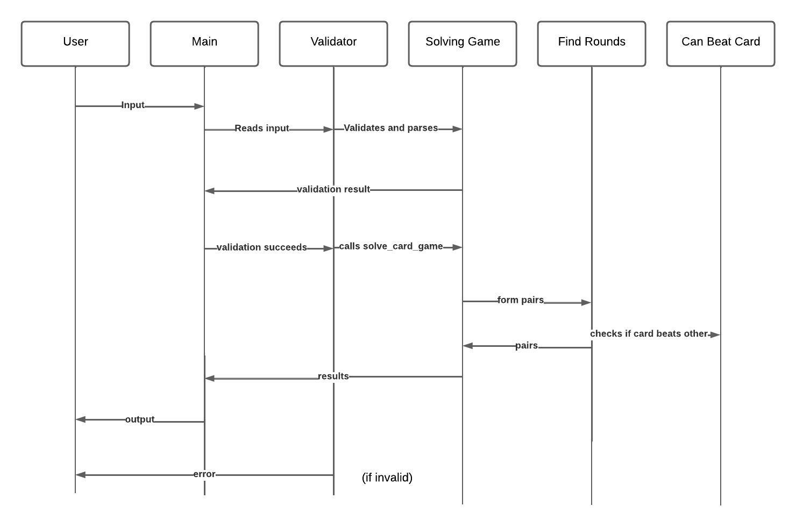

# Paradigm-CardGame

## Description
I chose to solve a problem involving a card game from codeforces (1400) 
The solution required must  reconstruct the sequence of rounds played in a card game based on a given set of rules. Each round involves two players playing a card, with the second player needing to beat the card played by the first.
I adapted my solution to this problem by adding the use of a CFG and lambda functions
link: https://codeforces.com/problemset/problem/1932/D

I modelled my solution with a sequence diagram

## Model of the Solution
This sequence diagram shows how the program works :


## Implementation
The solution is implemented in Python.

Functional Paradigm

Input handling: The input is read and parsed to extract the number of test cases, the number of rounds in each test case, the trump suit, and the descriptions of the cards.

Parsing and Validation: The input text is parsed and validated using a context-free grammar (CFG). The NLTK library is utilized for parsing the input text based on the defined grammar rules. The grammar ensures that the input follows the correct format and syntax required for the card game problem.

The implementation defines rules for comparing cards using lambda functions to determine if one card can beat another. Cards are compared based on their ranks and suits, considering the trump suit if applicable.

Recursive Pair Formation: A recursive algorithm is used to form pairs of cards for each round of the game. Starting with all available cards, the algorithm recursively selects pairs of cards that meet the game rules until the required number of rounds is reached.

Result Generation: The implementation generates the output based on the formed pairs of cards. If a valid solution is found, the pairs of cards for each round are printed. Otherwise, "IMPOSSIBLE" is printed to indicate that no valid solution exists.

## Tests

The input test cases are shown in the code forces problem with its respective output. They are implemented in the end of the document and shown when running the code

The first line contains integer 𝑡 (1≤𝑡≤100) — the number of test cases. Then 𝑡 test cases follow.

The first line of a test case contains the integer number 𝑛 (1≤𝑛≤16).

The second line of a test case contains one character, the trump suit. It is one of "CDHS".

The third line of a test case contains the description of 2𝑛 cards. Each card is described by a two-character string, the first character is the rank of the card, which is one of "23456789", and the second one is the suit of the card, which is one of "CDHS". All cards are different.

Example Flow for a Single Test Case

Input: 3 S 3C 9S 4C 6D 3S 7S
Validation: Input is tokenized and checked against the CFG.
If valid, proceed to solve.
Solve:
For n=3, try to form pairs such as:
3C vs 9S (9S beats 3C)
4C vs 6D (6D beats 4C)
3S vs 7S (7S beats 3S)

*pairs are formed so that the right card wins against the left card*
Test cases outputs:
```
3C 9S
4C 3S
6D 7S
IMPOSSIBLE
IMPOSSIBLE
3S 7S
9S 9H
9H 9S
IMPOSSIBLE
9S 9C
6H 8C
```

I implemented additional test cases to prove the functionality of the program:
```
test_input2 = """
    2
    12 
    D
    6C 9D 7D 2D 4S 5D 8H 9D 2D 6S 4C 3C 2D 5D 3H 2H 5S 5S 6D 8S 3S 4D 2H 3D
    1
    H
    2H 2H
    """
```
Output Proving Fucntionality:
```
6C 9D
7D 9D
2D 5D
4S 2D
8H 2D
6S 5D
4C 6D
3C 4D
2H 3H
5S 8S
3S 5S
2H 3D
IMPOSSIBLE
```

## Analysis

This problem could have been solved in lots of other ways, for example, using a logic paradigm. Implementing the rules in prolog, was my first try at this, however I began having issues with my program specifically managing states and ensuring the rules for card comparisons were correctly implemented, with this approach, my output would always be "IMPOSSIBLE", and even though this could have been an effective solution to solve the problem, i opted for a Functional Paradigm and implemented a grammar with recursion to make parsing and rule application easier. The results of this decision provided a balance of readability and ease of debugging, resulting in a more efficient solution to the card game problem.

The can_beat function compares two cards to determine if one can beat the other based on the game rules. This operation has a constant time complexity of O(1).
While the overall solution leveraged recursion for parsing and rule application, the time complexity remains manageable for typical input sizes.